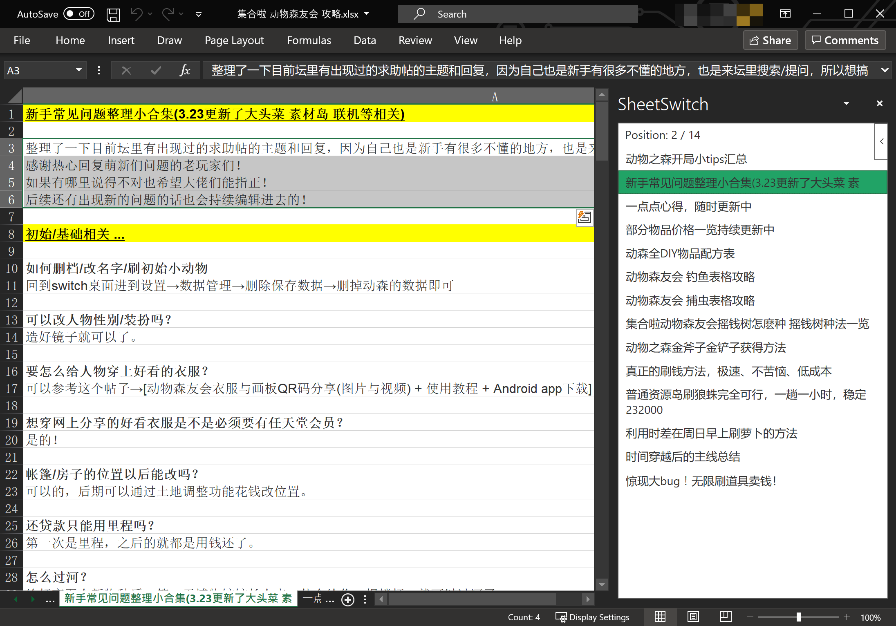
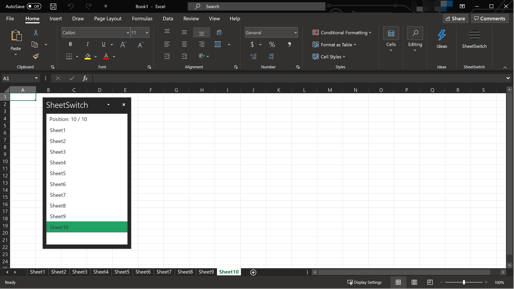

# SheetSwitch

Quickly switch worksheets in a sidebar for Excel. Handy for cases where you have a lot worksheets or worksheet names are really long.

## Installation

Microsoft does not allow personal developer without a company to publish add-ins, so currently you can only sideload this plugin if you want to use it. 

### Sideloading

* [Windows](https://github.com/Jamesits/SheetSwitch/wiki/Sideloading:-Windows)
* [macOS](https://github.com/Jamesits/SheetSwitch/wiki/Sideloading:-macOS)
* [Other platforms](https://docs.microsoft.com/en-us/office/dev/add-ins/testing/test-debug-office-add-ins#sideload-an-office-add-in-for-testing)

After sideloading the metadata, go to Excel -> Insert -> Add-ins -> My Add-ins (drop-down menu) -> Developer Add-ins and click SheetSwitch to activate the add-in.

### Other Installation Methods

e.g. if you are a SharePoint admin and want to make it available to all of your company's computer:

https://docs.microsoft.com/en-us/office/dev/add-ins/publish/publish

## Usage

1. Excel -> Home -> SheetSwitch
